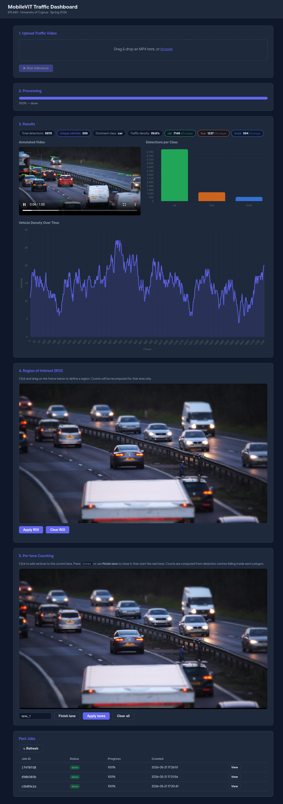

# MobileViT-Based Traffic Analysis for Digital Twin Optimization

> **EPL 445 – Digital Video Processing** | University of Cyprus, Spring 2026
>
> Team: Andreas Demosthenous & Marios Olymbios



## Overview

This project implements a **frame-level traffic classification** system using a
**MobileViT** backbone. Given traffic video footage, the pipeline:

1. Extracts and crops vehicle patches from annotated frames
2. Trains a MobileViT classifier to recognise vehicle types
3. Evaluates with accuracy, F1, sensitivity, specificity, ROC/AUC
4. Runs inference on new video, producing annotated output + class counts

### Target classes

| Class        | Description               |
|-------------|---------------------------|
| `car`        | Passenger cars             |
| `bus`        | Buses                      |
| `truck`      | Trucks, vans, heavy vehicles |
| `background` | Non-vehicle patches        |

---

## Quick Start

### 1. Install dependencies

```bash
# Create and activate a virtual environment (recommended)
python -m venv venv
source venv/bin/activate

# Install all dependencies
pip install -r requirements.txt

# Install project in editable mode
pip install -e .
```

### 2. Prepare the dataset

Download and process the **UA-DETRAC** dataset:

```bash
python scripts/prepare_dataset.py --data-root data
```

This will:
- Download UA-DETRAC train images and annotations (~4 GB)
- Crop vehicle patches by class
- Generate stratified train/val/test CSV splits

> **Note:** If the download is too slow, manually download the files and use
> `--skip-download` with files placed in `data/raw/`.

### 3. Train the model

```bash
bash scripts/run_train.sh
# or directly:
python -m src.training.train --config configs/train.yaml
```

Training uses **staged fine-tuning**:
- Epochs 1–3: backbone frozen, only classifier head trains
- Epochs 4+: full model fine-tuned with reduced learning rate

Best checkpoint is saved to `outputs/models/best_model.pth`.

### 4. Evaluate

```bash
bash scripts/run_eval.sh
# or directly:
python -m src.evaluation.evaluate --config configs/eval.yaml
```

Outputs:
- `outputs/metrics/test_metrics.json` — all numeric metrics
- `outputs/figures/confusion_matrix.png`
- `outputs/figures/roc_curves.png`
- `outputs/figures/per_class_f1.png`
- `outputs/figures/training_curves.png`

### 5. Video demo

The reference traffic clips aren't checked into git (too large). Fetch
them from the GitHub release first — this populates `data/raw/` and one
pre-encoded annotated example under `outputs/predictions/`:

```bash
bash scripts/fetch_videos.sh        # Linux / macOS
# scripts\fetch_videos.bat          # Windows (double-click also works)
```

Then run the demo:

```bash
bash scripts/run_demo.sh
# or, on Windows:
# scripts\run_demo.bat
```

Outputs:
- `outputs/predictions/annotated_output.mp4` — video with class labels
- `outputs/predictions/frame_predictions.csv` — per-frame predictions
- `outputs/predictions/class_counts.json` — aggregated counts

---

## Project Structure

```
├── configs/            # YAML configuration files
├── data/               # Dataset (raw, processed, splits)
├── scripts/            # CLI scripts and shell wrappers
├── src/
│   ├── datasets/       # Dataset classes and transforms
│   ├── models/         # MobileViT classifier wrapper
│   ├── training/       # Training loop, losses, engine
│   ├── evaluation/     # Metrics computation and plotting
│   ├── inference/      # Image/video prediction, aggregation, SORT, ROI, stream, YOLO bridge
│   ├── utils/          # Seed, device, I/O, logging
│   └── app/            # FastAPI dashboard (main.py, jobs, analytics, static/)
├── outputs/            # Figures, metrics, models, predictions
├── tests/              # Unit tests
├── requirements.txt
├── pyproject.toml
└── README.md
```

---

## Metrics (test set, sequence-disjoint)

| Metric           | Value   |
|------------------|---------|
| Accuracy         | 96.44%  |
| Macro F1         | 95.90%  |
| Macro Precision  | 95.69%  |
| Macro Recall     | 96.15%  |
| Macro AUC        | 99.59%  |

| Class      | Precision | Recall | Specificity | F1    |
|------------|-----------|--------|-------------|-------|
| car        | 0.960     | 0.929  | 0.992       | 0.944 |
| bus        | 0.992     | 0.974  | 0.994       | 0.983 |
| truck      | 0.937     | 0.963  | 0.977       | 0.950 |
| background | 0.939     | 0.980  | 0.990       | 0.959 |

The test set has 2,614 patches drawn from 16 video sequences not seen during training.
Validation macro F1 on the best epoch reached **0.9807**.

---

## Phase 3 features (final demo, 25 May 2026)

### Web dashboard

```bash
# Wrapper script — sets the ROCm env vars and pins the live stream
# to CPU so the offline GPU job and the live stream don't fight over
# the iGPU's shared VRAM. Required on the Radeon 780M (gfx1103).
bash scripts/run_dashboard.sh

# Or manually (no stability guarantees on AMD iGPU):
HSA_OVERRIDE_GFX_VERSION=11.0.0 \
  uvicorn src.app.main:app --host 0.0.0.0 --port 8000
```

Optional local RTSP demo (publishes `data/raw/traffic_long.mp4` at
`rtsp://localhost:8554/traffic`):

```bash
bash scripts/start_rtsp.sh --detach
```

Open <http://localhost:8000>. The dashboard supports:

- Drag-and-drop video upload, with background inference and live progress.
- Per-class detection bar chart and vehicle-density timeline (Chart.js).
- Rectangle ROI selection for region-filtered counts.
- Polygon **lane** definition (click to add vertices, multiple lanes), per-lane per-class counts using `ROILaneCounter`.
- SORT-tracked unique vehicle counts surfaced alongside the raw detection counts.
- Annotated H.264 video playback (auto-transcoded from OpenCV `mp4v`).
- Past-jobs table to re-open completed runs.

### Detector backends

`configs/demo.yaml` selects the detector:

- `detector: yolo` — YOLOv8-nano emits one tight box per vehicle, MobileViT classifies each crop. Default.
- `detector: sliding` — multi-scale sliding window (120/180/256 px) + NMS. Used in Interim #2.

### Cross-frame tracking

SORT (Bewley et al., 2016) assigns persistent IDs across frames. `enable_tracking: true` in `configs/demo.yaml` (default). The CSV gets a `track_id` column and `aggregate_counts` reports `unique_vehicles_by_class`.

### Density plots

```bash
python -m src.evaluation.density_plot --input outputs/predictions/frame_predictions.csv
```

### Speed/accuracy benchmark

```bash
python scripts/benchmark.py --checkpoint outputs/models/best_model.pth --output outputs/metrics
```

### Live stream (RTSP, webcam, file)

```bash
python -m src.inference.stream --source 0                            # webcam
python -m src.inference.stream --source rtsp://camera.local/stream   # IP camera
```

---

## Windows quickstart

The Linux wrappers (`scripts/run_*.sh`) export ROCm env vars used only by
the Radeon 780M iGPU in this project's dev machine. Windows users should
use the PowerShell / batch equivalents — they skip the AMD-Linux flags
and let the cross-platform `run_dashboard.py` launcher pick CUDA,
DirectML, or CPU automatically.

```powershell
# 1. Clone + install
git clone https://github.com/AndrewDemsDS/EPL445_MobileViT.git
cd EPL445_MobileViT
python -m venv venv
.\venv\Scripts\Activate.ps1
pip install -r requirements.txt
pip install -e .

# 2. Fetch demo videos (~380 MB) from the GitHub release
.\scripts\fetch_videos.ps1            # or: scripts\fetch_videos.bat

# 3. Launch the dashboard at http://localhost:8000
.\scripts\run_dashboard.ps1           # or: scripts\run_dashboard.bat

# Other entry points
.\scripts\run_train.ps1
.\scripts\run_eval.ps1
.\scripts\run_demo.ps1
```

If PowerShell blocks the `.ps1` scripts, either run them through the
`.bat` shims or relax the policy for the current user:
`Set-ExecutionPolicy -Scope CurrentUser RemoteSigned`.

GPU notes for Windows:

- **NVIDIA** — install a CUDA-enabled PyTorch wheel from
  <https://pytorch.org/get-started/locally/> *before* `pip install -r
  requirements.txt`. The launcher reports `CUDA (<device name>)` on
  start.
- **AMD** — install [`torch-directml`](https://learn.microsoft.com/en-us/windows/ai/directml/pytorch-windows)
  for GPU acceleration on Radeon; the launcher will pick it up and print
  `DirectML (...)`. ROCm itself is Linux-only and is not used on
  Windows.
- **CPU only** — works out of the box, just slower.

## Running Tests

```bash
python -m pytest tests/ -v
```

---

## Configuration

All settings are controlled via YAML files in `configs/`:

- `default.yaml` — shared defaults (model, image size, classes)
- `train.yaml` — training hyperparameters
- `eval.yaml` — evaluation settings and checkpoint path
- `demo.yaml` — video inference settings

---

## References

- MobileViT: [Mehta & Rastegari, 2022](https://arxiv.org/abs/2110.02178)
- UA-DETRAC: [Wen et al., 2020](https://detrac-db.rit.albany.edu/)
- timm: [Wightman, 2019](https://github.com/huggingface/pytorch-image-models)
