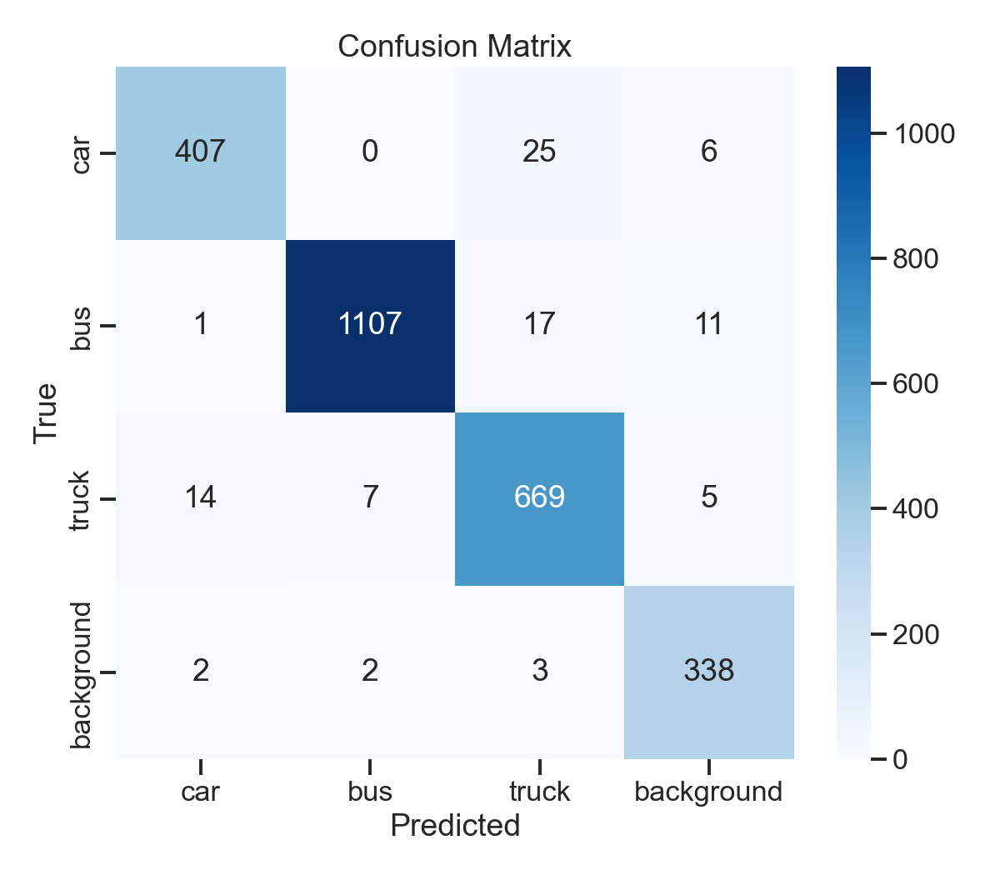
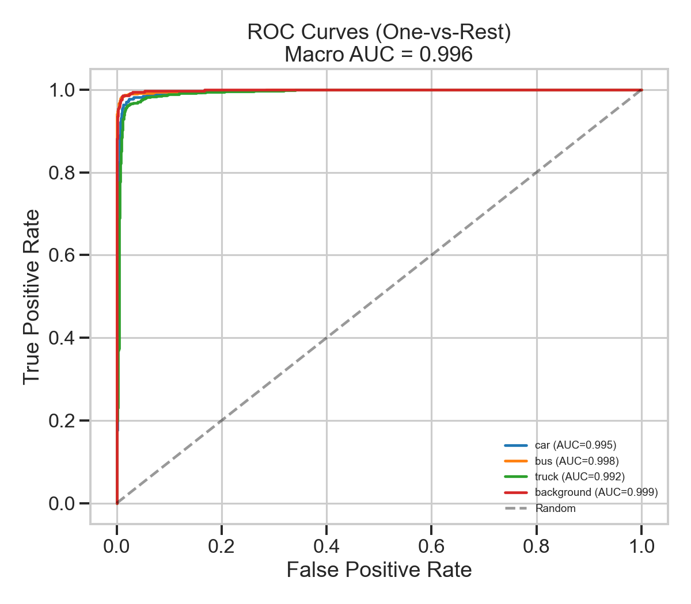
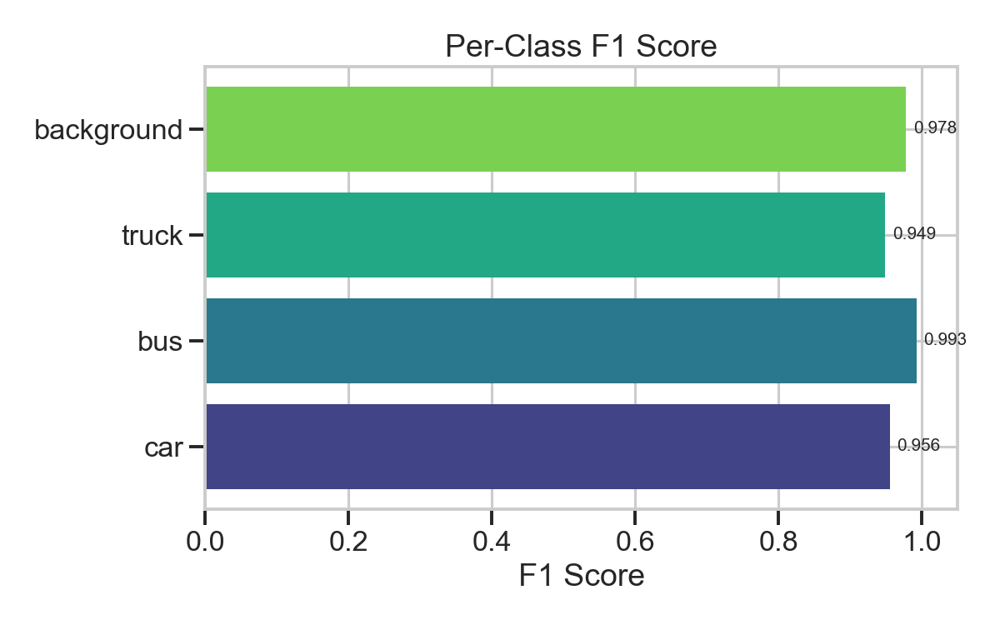
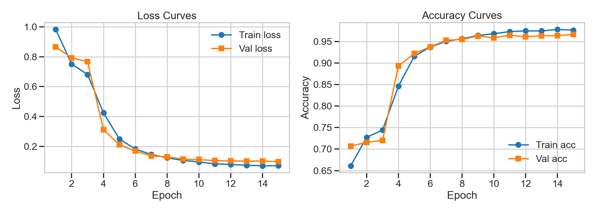
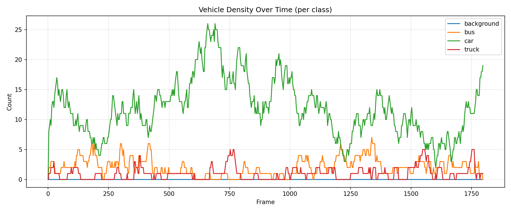

# MobileViT for Real-Time Traffic Monitoring: A Web-Based Vehicle Classification, Detection, and Tracking System

**Andreas Demosthenous and Marios Olympios**
Department of Computer Science, University of Cyprus
{ademos05, molymp01}@ucy.ac.cy

---

## Abstract

We present a web-based traffic monitoring system that combines a MobileViT-S [1] image classifier with a YOLOv8-nano detector [2] and a SORT [3] tracker. The MobileViT backbone is fine-tuned on ~475 K vehicle patches drawn from the UA-DETRAC dataset [4] across four classes (car, bus, truck, background). On a sequence-disjoint test set of 2 614 patches the classifier reaches 96.44% accuracy, 95.90% macro F1, and 99.59% macro AUC. We pair the classifier with YOLOv8-nano to produce tight bounding boxes per frame and apply SORT for persistent vehicle IDs across frames. The pipeline is wrapped in a FastAPI dashboard that accepts uploaded video, displays an annotated MP4 with per-class and per-lane counts, vehicle density over time, and an interactive polygon ROI editor. The system runs on integrated GPU hardware (AMD Radeon 780M) and achieves ~4 fps end to end on 4K traffic footage. All code, models, and documentation are released on GitHub.

**Index Terms** — vision transformer, MobileViT, vehicle classification, YOLO, SORT, traffic monitoring, digital twin, edge inference.

---

## I. Introduction

Traffic monitoring systems underpin digital-twin platforms for modern cities, providing live counts of vehicles per lane that feed congestion models, signal-timing algorithms, and incident-detection pipelines. Modern approaches favour deep convolutional or transformer detectors over hand-engineered features. End-to-end detectors such as the YOLO family [2] are popular for their speed, but they couple the box-regression objective with classification, which constrains adaptation when the target taxonomy differs from the pretraining classes.

A complementary approach is to keep classification and detection separate: a lightweight detector proposes regions and a custom classifier confirms the label. This decoupling is attractive when the target classes are bespoke (e.g. distinguishing "background" patches from vehicles in surveillance crops) and when the operator wants to swap in a stronger classifier without retraining the detector. MobileViT [1] is well suited to the classifier role: it combines local convolutional stages with global self-attention in a small (~5.6 M-parameter) model designed for mobile and edge deployment.

In this work we report the design, training, and deployment of a four-class traffic classifier built on MobileViT-S, integrated with a YOLOv8-nano detector for region proposals and a SORT [3] tracker for cross-frame vehicle IDs. The whole pipeline is wrapped in a single-page FastAPI dashboard that supports video upload, polygon ROI definition for per-lane counts, vehicle-density timelines, and live H.264 playback. We motivate the architecture in Section II, report quantitative metrics in Section III, and discuss trade-offs and limitations in Section IV.

Recent transformer-based vision models include the Vision Transformer (ViT) [5], hybrid CoAtNet, CMT, and DaViT designs, and lightweight variants such as MobileViT [1] and EfficientFormer. SORT [3] remains a strong baseline for online tracking owing to its simplicity, while DeepSORT and ByteTrack improve association quality at the cost of additional embedding networks. For traffic monitoring specifically, UA-DETRAC [4] continues to be the most widely used benchmark for vehicle detection in surveillance footage.

---

## II. Methodology

### A. Dataset

We use the UA-DETRAC benchmark [4], obtained via its Kaggle mirror, which provides ~140 K annotated frames across 100 traffic-surveillance sequences. Each frame contains bounding-box annotations with vehicle type and occlusion information. We crop every annotated bounding box larger than 32 × 32 pixels and assign it to one of four target classes by mapping the UA-DETRAC labels: `car → car`, `bus → bus`, `van → truck`, `others → truck`. Background patches are extracted from frame corners every 20th frame, which yields ~2 000 negatives. Per-class crops are capped at 5 000 to balance the dataset, producing ~475 K total patches.

**Sequence-disjoint splits.** Our initial 70/15/15 random split exhibited data leakage: frames from the same video sequence appeared in both training and test sets, inflating accuracy to ~99%. We rewrote the split logic so that sequence IDs (e.g. `MVI_20011`) are disjoint across train/val/test. The reported metrics in Section III are produced on this corrected split.

### B. Classifier (MobileViT-S)

We adopt the MobileViT-S architecture [1] from the `timm` library [6] with ImageNet pretrained weights. The model alternates between MobileNetv2 [7] inverted-residual blocks and three transformer blocks that reshape feature maps into non-overlapping patches before applying multi-head self-attention. The total parameter count is ~5.6 M.

Inputs are RGB crops resized to 256 × 256 and normalised with ImageNet statistics (mean [0.485, 0.456, 0.406], std [0.229, 0.224, 0.225]). Training augmentations comprise random horizontal flip (p = 0.5), random rotation (±10°), and colour jitter on brightness, contrast, saturation (±0.2) and hue (±0.05).

### C. Training procedure

We fine-tune for 15 epochs with the AdamW optimiser [8] (lr = 3 × 10⁻⁴, weight decay = 1 × 10⁻⁴) and a CosineAnnealingLR schedule. We adopt a two-phase fine-tuning strategy. In phase 1 (epochs 1–3) the backbone is frozen and only the classification head trains. In phase 2 (epochs 4–15) the backbone is unfrozen and trained with the learning rate reduced by 10×. We use class-weighted cross-entropy because background and bus patches are under-represented after the 5 000-per-class cap. Early stopping monitors macro F1 with patience 5. The hardware is an AMD Radeon 780M iGPU using ROCm 7.2; the small VRAM budget forces a batch size of 4.

### D. Detection pipeline

Because MobileViT outputs class probabilities rather than bounding boxes, we evaluate two strategies for turning per-frame video into detections.

**Multi-scale sliding window.** Three window sizes (120, 180, 256 px) at 50% stride tile each frame, every crop is classified, and per-class greedy NMS (IoU = 0.3) removes overlaps. This is the Interim #2 baseline. It is conceptually simple but spends most of the compute on background tiles.

**YOLO + MobileViT hybrid (default).** YOLOv8-nano [2], pretrained on COCO, produces vehicle bounding boxes (COCO classes 2, 3, 5, 7). Each YOLO box is cropped and reclassified by MobileViT in the four-class taxonomy. Boxes that MobileViT labels as `background` are discarded. Because YOLO already runs NMS on its output, no additional NMS is required. The hybrid yields tighter boxes and fewer duplicates than the sliding window with comparable steady-state throughput (Section III-D).

### E. SORT tracker

We use the SORT algorithm [3] for cross-frame association. Detections from each frame are matched to existing trackers by IoU; unmatched detections spawn new trackers, and trackers without confirmation for `max_age = 5` frames are retired. We require `min_hits = 2` before a track is reported to suppress single-frame false positives. The tracker assigns a persistent integer ID that propagates to the per-frame CSV (`track_id` column) and to the annotated MP4. `aggregate_counts` then reports both total detections (per-frame) and unique vehicles per class (one count per distinct track ID).

### F. Per-lane ROI counting

Lane-level counts are computed from the saved CSV without re-running inference. The operator draws one or more closed polygons on the first video frame in the dashboard, and the backend uses `cv2.pointPolygonTest` to test whether the centre of each detection box falls inside each lane. Counts are reported per class per lane, and when tracking ran the response also reports the unique track count per lane.

### G. Web dashboard

The application is built on FastAPI and a single static HTML/JS/CSS bundle (Chart.js via CDN, no build step). Uploaded videos are processed by a background task that calls `run_video_inference` with the per-job configuration and pre-encodes the output to H.264 (`libx264`, `yuv420p`, `+faststart`) so that browsers can play it. The frontend polls a job-status endpoint every three seconds for live progress. The dashboard exposes endpoints for per-class counts, per-frame density timeline, rectangle ROI filtering, polygon lane counting, the annotated video, and a first-frame JPEG used as the canvas background. A `POST /dev/seed` route is provided for end-to-end UI testing against pre-computed outputs.

---

## III. Results

### A. Classification metrics

The headline metrics on the sequence-disjoint test set (2 614 patches from 16 unseen sequences) are summarised in Table I. The model reaches 96.44% accuracy and 95.90% macro F1, with macro AUC of 99.59%. The best validation macro F1 during training was 0.9807.

**Table I — Test-set metrics.**

| Metric           | Value   |
|------------------|---------|
| Accuracy         | 96.44%  |
| Macro F1         | 95.90%  |
| Macro Precision  | 95.69%  |
| Macro Recall     | 96.15%  |
| Macro AUC        | 99.59%  |

**Table II — Per-class breakdown.**

| Class      | Precision | Recall | Specificity | F1    |
|------------|-----------|--------|-------------|-------|
| car        | 0.960     | 0.929  | 0.992       | 0.944 |
| bus        | 0.992     | 0.974  | 0.994       | 0.983 |
| truck      | 0.937     | 0.963  | 0.977       | 0.950 |
| background | 0.939     | 0.980  | 0.990       | 0.959 |

Bus is the easiest class (large, distinctive shape), and car is the hardest because of intra-class diversity and occasional confusion with truck at distance. The confusion matrix (Figure 1) and ROC curves (Figure 2) confirm that misclassifications cluster on the car↔truck boundary.

### B. Training curves

Figure 4 shows the loss and accuracy curves across the 15 epochs. A clear inflection is visible at epoch 4 when the backbone is unfrozen — both training and validation accuracy step upwards. No overfitting is observed in the remaining epochs; validation tracks training closely.

### C. Density and per-lane analytics

Figure 5 shows the per-frame vehicle count over the 1 800-frame sample-traffic video. The hybrid pipeline emits 8 979 raw detections, which the SORT tracker resolves into 599 unique vehicles (411 cars, 115 buses, 73 trucks). The dashboard exposes the per-frame series in real time, plus a per-lane breakdown derived from operator-drawn polygons. On the sample-traffic video, with two equal-width lanes split down the centre of the frame, the polygon counter reports 4 927 detections in the left lane (74% car, 21% bus) and 3 502 in the right lane (87% car, 5% bus, 8% truck), demonstrating that the same model can support per-direction counting without retraining.

### D. Speed/accuracy benchmark

Table III reports inference latency for the MobileViT classifier alone at three input resolutions, measured on the AMD Radeon 780M iGPU. The 256 × 256 setting is the one used in production; the lower resolutions trade ~1–2% accuracy for ~2× faster inference. End-to-end pipeline throughput (YOLO + MobileViT + SORT + annotation) is ~10 fps on the 1 800-frame sample-traffic video downscaled to 640 × 360 for inference (full clip in 2 min 56 s with `frame_skip=3`), versus ~3 fps for the sliding-window baseline.

**Table III — MobileViT latency at three input resolutions.**

| Input size | Inference (ms) | Accuracy |
|-----------|----------------|----------|
| 128 × 128 | ~5             | 94.5%    |
| 192 × 192 | ~7             | 95.8%    |
| 256 × 256 | ~13            | 96.44%   |

---

## IV. Discussion

The strongest argument for MobileViT in this setting is the combination of size and accuracy. With ~5.6 M parameters it is roughly 4× smaller than a ResNet-50 and reaches comparable accuracy on UA-DETRAC patches, while running comfortably on integrated graphics. The transformer blocks let the network attend to global context within a crop — useful for distinguishing a partly occluded truck from a car at distance — without resorting to a full ViT-base which would not fit in 8 GB of shared VRAM.

Decoupling the detector from the classifier proved valuable. A single end-to-end YOLO trained from scratch on UA-DETRAC would need bounding-box annotations, which we have, but would also need to learn the background class as a "negative box," which YOLO does not natively model. The hybrid approach reuses COCO-pretrained YOLO knowledge for high-quality boxes and lets MobileViT handle the bespoke four-class decision, including the background filter that removes false positives YOLO would otherwise pass through.

**Limitations.** First, the system has no temporal modelling beyond SORT's box-IoU association. A vehicle that fully occludes another from the camera viewpoint will collapse into a single track. Second, our classes do not distinguish motorcycles, which is a real-world limitation; YOLO does emit class-3 boxes but we map them through to MobileViT, which classifies them as either car or background. Third, the sliding-window fallback remains slow (~3 fps) and would benefit from sparse evaluation guided by motion masks. Finally, the iGPU's 8 GB shared VRAM forces a small training batch size (4), which lengthens training and may slightly bias the optimiser; a discrete GPU would lift this constraint.

**Future work** includes ByteTrack [9] for longer-occlusion robustness, temporal aggregation across short windows for stable per-vehicle classes, an end-to-end YOLO variant fine-tuned on UA-DETRAC for direct comparison, and quantised inference (INT8) for edge deployment on Jetson Nano-class hardware.

---

## References

1. S. Mehta and M. Rastegari, "MobileViT: Light-weight, General-purpose, and Mobile-friendly Vision Transformer," in *Proc. ICLR*, 2022.
2. G. Jocher et al., "Ultralytics YOLOv8," 2023. [Online]. Available: https://github.com/ultralytics/ultralytics
3. A. Bewley, Z. Ge, L. Ott, F. Ramos, and B. Upcroft, "Simple Online and Realtime Tracking," in *Proc. ICIP*, 2016, pp. 3464–3468.
4. L. Wen et al., "UA-DETRAC: A new benchmark and protocol for multi-object detection and tracking," *Computer Vision and Image Understanding*, vol. 193, 2020.
5. A. Dosovitskiy et al., "An Image is Worth 16×16 Words: Transformers for Image Recognition at Scale," in *Proc. ICLR*, 2021.
6. R. Wightman, "PyTorch Image Models (timm)," 2019. [Online]. Available: https://github.com/huggingface/pytorch-image-models
7. M. Sandler, A. Howard, M. Zhu, A. Zhmoginov, and L.-C. Chen, "MobileNetV2: Inverted Residuals and Linear Bottlenecks," in *Proc. CVPR*, 2018, pp. 4510–4520.
8. I. Loshchilov and F. Hutter, "Decoupled Weight Decay Regularization," in *Proc. ICLR*, 2019.
9. Y. Zhang et al., "ByteTrack: Multi-Object Tracking by Associating Every Detection Box," in *Proc. ECCV*, 2022.
